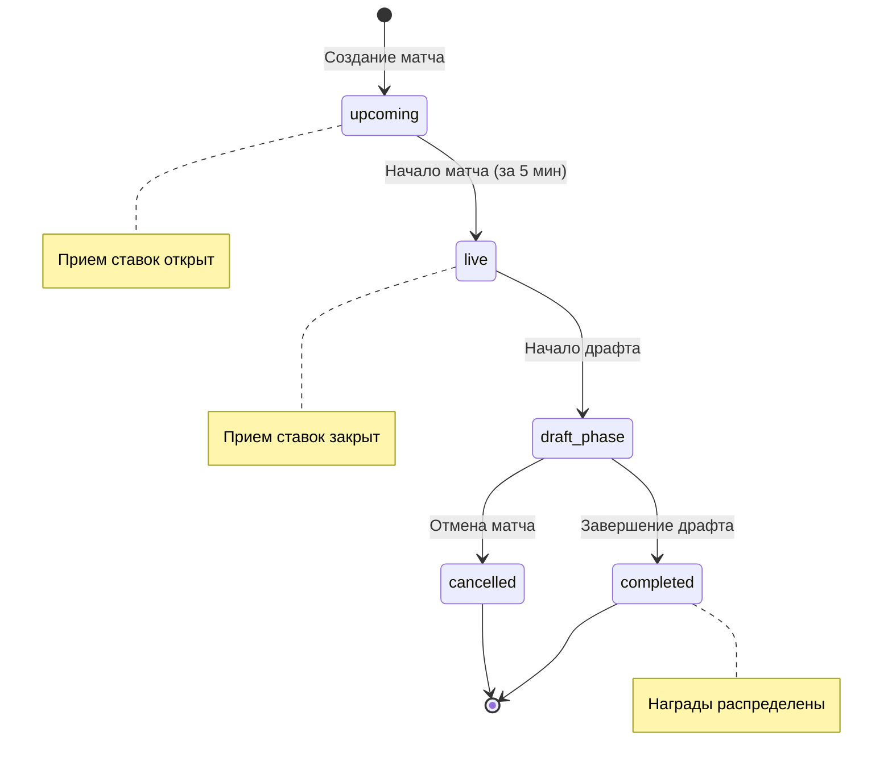
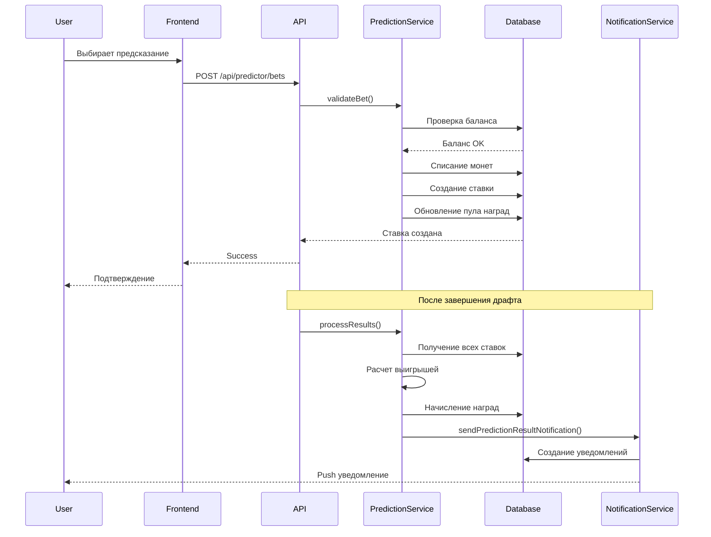

# Design Document: Pick Predictor System

## Overview

Pick Predictor System — это модуль для предсказания результатов драфта в киберспортивных матчах (Dota 2, CS2). Система интегрируется в существующее приложение Cybersport Cards и использует текущую архитектуру MongoDB + Express + React.

Основные компоненты:
- Backend API для управления матчами, предсказаниями и ставками
- Frontend интерфейс для пользователей и администраторов
- Система обработки результатов и начисления наград
- Уведомления о статусе предсказаний

## Architecture

### High-Level Architecture

```
┌─────────────────────────────────────────────────────────────┐
│                     React Frontend                          │
│  ┌──────────────┐  ┌──────────────┐  ┌──────────────┐     │
│  │ Pick Predictor│  │   Admin      │  │  User        │     │
│  │     Page     │  │   Panel      │  │  History     │     │
│  └──────────────┘  └──────────────┘  └──────────────┘     │
└─────────────────────────────────────────────────────────────┘
                            │
                            │ HTTP/REST API
                            ▼
┌─────────────────────────────────────────────────────────────┐
│                    Express Backend                          │
│  ┌──────────────┐  ┌──────────────┐  ┌──────────────┐     │
│  │  Predictor   │  │  Prediction  │  │  Reward      │     │
│  │  Routes      │  │  Service     │  │  Service     │     │
│  └──────────────┘  └──────────────┘  └──────────────┘     │
└─────────────────────────────────────────────────────────────┘
                            │
                            │ Mongoose ODM
                            ▼
┌─────────────────────────────────────────────────────────────┐
│                      MongoDB Database                       │
│  ┌──────────────┐  ┌──────────────┐  ┌──────────────┐     │
│  │   Matches    │  │  Predictions │  │    Bets      │     │
│  │  Collection  │  │  Collection  │  │  Collection  │     │
│  └──────────────┘  └──────────────┘  └──────────────┘     │
└─────────────────────────────────────────────────────────────┘
```

### Technology Stack

**Backend:**
- Node.js + Express.js
- MongoDB + Mongoose
- Multer (для загрузки логотипов команд)
- JWT (существующая аутентификация)

**Frontend:**
- React 18
- React Router
- Axios (для API запросов)
- CSS Modules (следуя существующему стилю)

## Components and Interfaces

### Backend Components

#### 1. Data Models

**PredictorMatch Model** (`backend/models/predictorMatchModel.js`)
```javascript
{
  game: String,              // 'dota2' | 'cs2'
  team1: {
    name: String,
    logoUrl: String          // Путь к загруженному файлу
  },
  team2: {
    name: String,
    logoUrl: String
  },
  startTime: Date,
  status: String,            // 'upcoming' | 'live' | 'draft_phase' | 'completed' | 'cancelled'
  draftPhase: {
    started: Boolean,
    completed: Boolean,
    results: {
      firstBan: {
        team1: String,       // Название героя/агента
        team2: String
      },
      firstPick: {
        team1: String,
        team2: String
      },
      mostBanned: String,
      picks: {
        team1: [String],     // Массив выбранных героев/агентов
        team2: [String]
      }
    }
  },
  predictionTypes: [{
    type: String,            // 'first_ban_team1' | 'first_pick_team1' | 'most_banned' | etc.
    options: [String],       // Доступные герои/агенты для выбора
    rewardPool: Number,      // Общий пул наград
    betsCount: Number,       // Количество ставок
    closed: Boolean          // Закрыт ли прием ставок
  }],
  createdAt: Date,
  updatedAt: Date
}
```

**PredictorBet Model** (`backend/models/predictorBetModel.js`)
```javascript
{
  userId: ObjectId,          // ref: 'User'
  matchId: ObjectId,         // ref: 'PredictorMatch'
  predictions: [{
    type: String,            // Тип предсказания
    choice: String,          // Выбранный вариант
    betAmount: Number,       // Размер ставки
    odds: Number,            // Коэффициент на момент ставки
    status: String,          // 'pending' | 'won' | 'lost'
    reward: Number           // Выигрыш (если есть)
  }],
  totalBet: Number,          // Общая сумма ставок
  totalReward: Number,       // Общий выигрыш
  createdAt: Date,
  updatedAt: Date
}
```

**Notification Model** (`backend/models/notificationModel.js`)
```javascript
{
  userId: ObjectId,          // ref: 'User'
  type: String,              // 'match_starting' | 'prediction_result'
  title: String,
  message: String,
  data: {
    matchId: ObjectId,
    betId: ObjectId,
    reward: Number
  },
  read: Boolean,
  createdAt: Date,
  expiresAt: Date            // Автоудаление через 30 дней
}
```

#### 2. API Routes

**Predictor Routes** (`backend/routes/predictorRoutes.js`)

```
GET    /api/predictor/matches              - Получить список доступных матчей
GET    /api/predictor/matches/:id          - Получить детали матча
POST   /api/predictor/matches              - Создать матч (admin)
PUT    /api/predictor/matches/:id          - Обновить матч (admin)
DELETE /api/predictor/matches/:id          - Удалить матч (admin)
POST   /api/predictor/matches/:id/results  - Установить результаты драфта (admin)
POST   /api/predictor/matches/:id/logo     - Загрузить логотип команды (admin)

GET    /api/predictor/bets                 - Получить ставки пользователя
POST   /api/predictor/bets                 - Создать ставку
GET    /api/predictor/bets/:id             - Получить детали ставки
GET    /api/predictor/history              - История предсказаний пользователя

GET    /api/predictor/stats/:matchId       - Статистика ставок по матчу
GET    /api/predictor/notifications        - Получить уведомления
PUT    /api/predictor/notifications/:id    - Отметить уведомление как прочитанное
```

#### 3. Services

**PredictionService** (`backend/services/predictionService.js`)
- `calculateOdds(matchId, predictionType)` - Расчет коэффициентов
- `validateBet(userId, betData)` - Валидация ставки
- `placeBet(userId, betData)` - Размещение ставки
- `closeBetting(matchId)` - Закрытие приема ставок
- `processResults(matchId, results)` - Обработка результатов
- `distributeRewards(matchId)` - Распределение наград

**NotificationService** (`backend/services/notificationService.js`)
- `sendMatchStartingNotification(userId, matchId)` - Уведомление о начале матча
- `sendPredictionResultNotification(userId, betId)` - Уведомление о результатах
- `scheduleMatchNotifications(matchId)` - Планирование уведомлений
- `cleanupExpiredNotifications()` - Очистка старых уведомлений

### Frontend Components

#### 1. Pages

**PredictorPage** (`cybersport-cards/src/pages/PredictorPage.js`)
- Главная страница пикем-предиктора
- Список доступных матчей
- Фильтры по игре (Dota 2 / CS2)
- Навигация к деталям матча

**PredictorMatchPage** (`cybersport-cards/src/pages/PredictorMatchPage.js`)
- Детальная страница матча
- Отображение доступных типов предсказаний
- Форма для размещения ставок
- Статистика и коэффициенты
- Таймер до закрытия ставок

**PredictorHistoryPage** (`cybersport-cards/src/pages/PredictorHistoryPage.js`)
- История предсказаний пользователя
- Фильтры по игре, дате, статусу
- Общая статистика (процент успеха, выигрыш/проигрыш)

#### 2. Components

**MatchCard** (`cybersport-cards/src/components/predictor/MatchCard.js`)
```jsx
Props:
- match: Object (данные матча)
- onClick: Function

Отображает:
- Логотипы команд
- Названия команд
- Время начала
- Игру (Dota 2 / CS2)
- Статус ("Скоро начнется" / "Доступно")
```

**PredictionForm** (`cybersport-cards/src/components/predictor/PredictionForm.js`)
```jsx
Props:
- match: Object
- predictionType: Object
- onSubmit: Function

Отображает:
- Список доступных вариантов (героев/агентов)
- Поле ввода суммы ставки
- Текущий коэффициент
- Потенциальный выигрыш
- Кнопку подтверждения
```

**PredictionStats** (`cybersport-cards/src/components/predictor/PredictionStats.js`)
```jsx
Props:
- matchId: String
- predictionType: String

Отображает:
- Процентное распределение ставок
- Количество участников
- Размер пула наград
- Обновление в реальном времени
```

**BetHistoryCard** (`cybersport-cards/src/components/predictor/BetHistoryCard.js`)
```jsx
Props:
- bet: Object

Отображает:
- Информацию о матче
- Сделанные предсказания
- Размер ставок
- Результат (выигрыш/проигрыш)
- Сумму выигрыша
```

**NotificationBell** (`cybersport-cards/src/components/predictor/NotificationBell.js`)
```jsx
Props:
- notifications: Array
- onRead: Function

Отображает:
- Иконку с количеством непрочитанных
- Выпадающий список уведомлений
- Кнопки для отметки как прочитанное
```

**AdminPredictorPanel** (`cybersport-cards/src/components/admin/AdminPredictorPanel.js`)
```jsx
Функционал:
- Создание нового матча
- Загрузка логотипов команд
- Настройка типов предсказаний
- Установка результатов драфта
- Просмотр статистики ставок
```

## Data Models

### Match Lifecycle



### Bet Processing Flow



### Odds Calculation Algorithm

Коэффициенты рассчитываются динамически на основе распределения ставок:

```
odds = (totalRewardPool / optionRewardPool) * 0.95

где:
- totalRewardPool - общий пул наград для типа предсказания
- optionRewardPool - сумма ставок на конкретный вариант
- 0.95 - комиссия системы (5%)
```

Минимальный коэффициент: 1.1
Максимальный коэффициент: 10.0

### Reward Distribution

При распределении наград:

1. Определяются все выигрышные ставки
2. Рассчитывается доля каждой ставки в общем пуле выигрышных ставок
3. Награда = (betAmount / totalWinningBets) * rewardPool * 0.95
4. Награды начисляются на баланс пользователей
5. Создаются уведомления о результатах

## Error Handling

### Backend Error Responses

```javascript
{
  success: false,
  error: {
    code: String,        // 'INSUFFICIENT_FUNDS' | 'BETTING_CLOSED' | etc.
    message: String,     // Человекочитаемое сообщение
    details: Object      // Дополнительные детали (опционально)
  }
}
```

### Common Error Scenarios

1. **Недостаточно средств**
   - Code: `INSUFFICIENT_FUNDS`
   - HTTP: 400
   - Action: Показать сообщение с текущим балансом

2. **Прием ставок закрыт**
   - Code: `BETTING_CLOSED`
   - HTTP: 400
   - Action: Обновить статус матча

3. **Матч не найден**
   - Code: `MATCH_NOT_FOUND`
   - HTTP: 404
   - Action: Перенаправить на список матчей

4. **Неверная сумма ставки**
   - Code: `INVALID_BET_AMOUNT`
   - HTTP: 400
   - Action: Показать допустимый диапазон (10-10000)

5. **Дубликат ставки**
   - Code: `DUPLICATE_BET`
   - HTTP: 400
   - Action: Показать существующую ставку

### Frontend Error Handling

- Все ошибки API отображаются через toast-уведомления
- Критические ошибки логируются в консоль
- При ошибке сети показывается retry-кнопка
- Валидация форм на клиенте перед отправкой

## Testing Strategy

### Backend Testing

**Unit Tests:**
- Тестирование моделей Mongoose (валидация схем)
- Тестирование PredictionService (расчет коэффициентов, распределение наград)
- Тестирование NotificationService (создание уведомлений)

**Integration Tests:**
- Тестирование API endpoints
- Тестирование полного цикла ставки (создание → обработка → награда)
- Тестирование загрузки файлов (логотипы команд)

**Test Cases:**
```javascript
describe('PredictionService', () => {
  test('calculateOdds returns correct odds', () => {
    // Тест расчета коэффициентов
  });
  
  test('placeBet deducts coins from user balance', () => {
    // Тест списания монет
  });
  
  test('distributeRewards correctly calculates winnings', () => {
    // Тест распределения наград
  });
  
  test('betting closes 5 minutes before match', () => {
    // Тест автозакрытия ставок
  });
});
```

### Frontend Testing

**Component Tests:**
- Рендеринг компонентов с различными props
- Взаимодействие пользователя (клики, ввод)
- Валидация форм

**Integration Tests:**
- Навигация между страницами
- API запросы и обработка ответов
- Обновление состояния после действий

**E2E Tests (опционально):**
- Полный флоу создания ставки
- Просмотр истории предсказаний
- Получение уведомлений

### Manual Testing Checklist

- [ ] Создание матча администратором
- [ ] Загрузка логотипов команд (PNG, JPG, SVG)
- [ ] Размещение ставки пользователем
- [ ] Проверка обновления баланса
- [ ] Отображение статистики в реальном времени
- [ ] Закрытие ставок за 5 минут до матча
- [ ] Установка результатов драфта
- [ ] Автоматическое начисление наград
- [ ] Получение уведомлений
- [ ] Просмотр истории предсказаний
- [ ] Фильтрация истории
- [ ] Проверка на разных устройствах (responsive)

## Security Considerations

1. **Аутентификация:**
   - Все endpoints требуют JWT токен
   - Admin endpoints проверяют роль пользователя

2. **Валидация данных:**
   - Проверка размера ставки (10-10000)
   - Проверка баланса перед списанием
   - Валидация формата файлов логотипов
   - Ограничение размера файлов (2 МБ)

3. **Защита от манипуляций:**
   - Коэффициенты рассчитываются на сервере
   - Результаты матчей устанавливаются только администраторами
   - Ставки нельзя изменить после размещения

4. **Rate Limiting:**
   - Ограничение количества ставок в минуту
   - Ограничение запросов к API

## Performance Considerations

1. **Database Indexing:**
   ```javascript
   // PredictorMatch
   matchSchema.index({ startTime: 1, status: 1 });
   matchSchema.index({ game: 1 });
   
   // PredictorBet
   betSchema.index({ userId: 1, createdAt: -1 });
   betSchema.index({ matchId: 1 });
   
   // Notification
   notificationSchema.index({ userId: 1, read: 1, createdAt: -1 });
   notificationSchema.index({ expiresAt: 1 }, { expireAfterSeconds: 0 });
   ```

2. **Caching:**
   - Кэширование списка матчей (обновление каждые 30 сек)
   - Кэширование статистики ставок (обновление каждые 10 сек)

3. **Pagination:**
   - История предсказаний: 20 записей на страницу
   - Уведомления: 50 записей на страницу

4. **Image Optimization:**
   - Сжатие загруженных логотипов
   - Конвертация в WebP формат
   - Генерация thumbnail версий

## Deployment Considerations

1. **Environment Variables:**
   ```
   PREDICTOR_BET_MIN=10
   PREDICTOR_BET_MAX=10000
   PREDICTOR_COMMISSION=0.05
   PREDICTOR_CLOSE_BETTING_MINUTES=5
   PREDICTOR_NOTIFICATION_MINUTES=10
   UPLOAD_MAX_SIZE=2097152
   ```

2. **Database Migration:**
   - Создание новых коллекций
   - Добавление индексов
   - Настройка TTL для уведомлений

3. **File Storage:**
   - Настройка директории для логотипов команд
   - Настройка прав доступа
   - Backup стратегия для файлов

4. **Monitoring:**
   - Логирование всех ставок
   - Мониторинг распределения наград
   - Алерты при ошибках обработки результатов

## Future Enhancements

1. **Real-time Updates:**
   - WebSocket для live обновлений статистики
   - Push-уведомления в браузере

2. **Advanced Analytics:**
   - Графики успешности предсказаний
   - Рейтинг лучших предсказателей
   - Статистика по командам и героям

3. **Social Features:**
   - Комментарии к матчам
   - Шаринг предсказаний
   - Лиги предсказателей

4. **Mobile App:**
   - React Native приложение
   - Push-уведомления на мобильных

5. **Integration:**
   - Автоматическое получение результатов через API
   - Интеграция с Twitch для live-матчей
